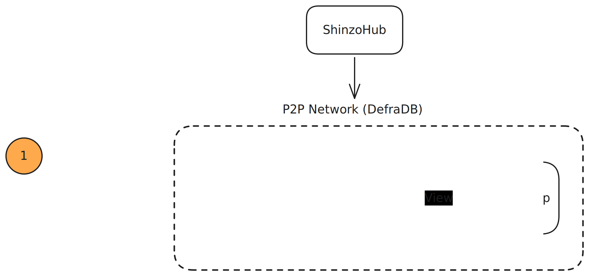
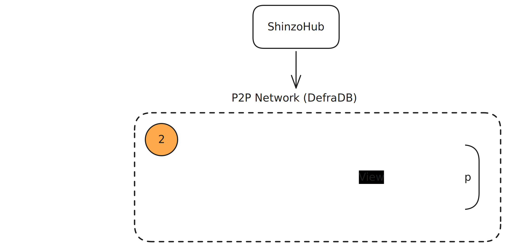
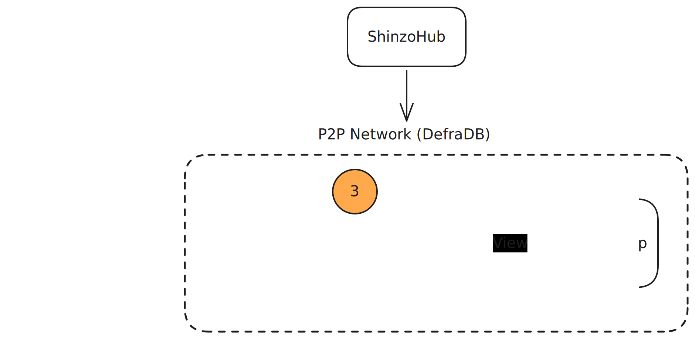
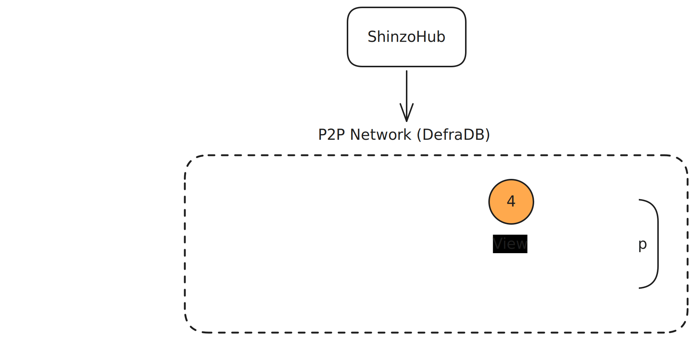
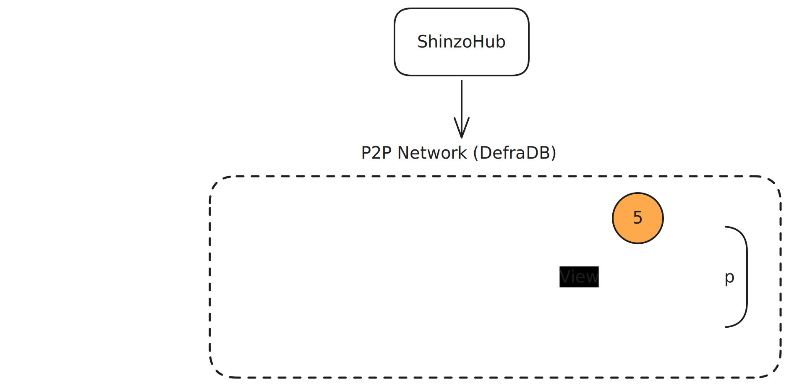

+++
title = "How it works"
weight = 2
+++
Shinzo has four kinds of moving parts: 

1. **Generators** that read the chain.
1. **Hosts** that transform and serve the data. 
1. **Applications** that consume that data.
1. **ShinzoHub**, a coordination layer that tells everyone what's going on. 

Data flows from left to right. Coordination happens on the side.

## The data's journey

Here's a single USDC transfer on Ethereum Mainnet, from the moment it lands on-chain to the moment an app shows it to a user.

### A block arrives at a validator

Somewhere on the network, an Ethereum validator's node produces or receives the block containing the transfer. The validator is already running a full execution client (Geth, typically) and already has the data. Shinzo takes advantage of that.

### The Generator structures and signs it

Sitting next to the Ethereum node is the Shinzo Generator client (a lightweight sidecar that subscribes to new blocks over WebSocket). As each block arrives, the Generator client pulls out the block metadata, transactions, logs, and access lists, normalizes them into structured documents, and cryptographically signs each one with its identity key. The USDC transfer shows up as a `Log` document with the transfer event topic, the sender, receiver, and amount, plus references back to the transaction and block it came from.

Those documents land in the Generator client's embedded [DefraDB](https://github.com/sourcenetwork/defradb) instance. DefraDB handles storage, versioning, and the peer-to-peer gossip that happens next.

### Hosts pick it up over P2P

Hosts subscribe to the primitive collection topics they care about (blocks, transactions, logs, access lists). When the Generator client's DefraDB gossips the new log document, subscribed Hosts receive it, verify the signature, and update an attestation record for it (essentially just a running tally of how many distinct Generator clients have signed off on this exact piece of data). If three Generator clients all wrote the same log, the attestation record has three votes. Apps can later use those votes to set their own trust thresholds.

### A View transforms primitives into something useful

A Host client with thousands of raw log documents isn't doing much for an app developer. That's what _Views_ are for. A developer writes a View that says, in effect: _"take Log documents, filter to the USDC contract address, decode the transfer topic using the ERC-20 ABI, and expose the result as a `TokenTransfer` type with `from`, `to`, and `amount` fields."_

The filtering and decoding are implemented as _Lens transforms_, which are WASM modules the developer authors with `viewkit` and deploys to ShinzoHub. Host clients that choose to serve the View run those transforms against primitives as they arrive and produce view documents. Because Lens transforms are deterministic, any Host client (or auditor) running the same transform on the same input gets the same output.

### The app queries locally

On the app side, things look (surprisingly) normal. The app embeds DefraDB using the [app-sdk](https://github.com/shinzonetwork/app-sdk), subscribes to the `TokenTransfer` View, and from then on, Hosts push new view documents to it over P2P. The app queries them with GraphQL against its local database. No per-query API call, no network round trip, and an attestation filter available for any query that needs it.

## The four participants

#### Generator clients

Generator clients are the entry point. Reserved for Ethereum validators at mainnet launch (and open to any node operator on devnet), they run as a sidecar to an existing execution client. Their only job is to read the chain, produce structured and signed primitives, and hand them off.

#### Hosts

Hosts are the workhorses. They receive primitives, maintain attestation records, run Views, and serve the resulting view documents to subscribers. Anyone can run a Host. See [Run a Host](#) for operational details and [Host Client reference](#) for internals.

#### Developers

Developers don't run anything on the network. They write Views with `viewkit`, deploy them to ShinzoHub, and build applications that subscribe to the resulting data.

#### Applications

Applications embed DefraDB locally, subscribe to the Views they need, and query the data like a regular database. Devs have the option of filtering results by attestation threshold when correctness matters more than speed.

## The coordination layer

ShinzoHub is a Cosmos SDK chain that sits to the side of the data path. It doesn't carry bulk data itself (that all flows over the P2P network between DefraDB instances). What ShinzoHub does is keep the registry of who's on the network and what they can do.

That means three things in practice: 

1. **View registration**: When a developer deploys a View, ShinzoHub validates and registers it, then emits an event that Hosts listen for.
1. **Participant tracking**: Generators and Hosts register themselves on-chain so the rest of the network can discover them.
1. **Access control**: When a user pays for access to a View via the Outpost contract, ShinzoHub broadcasts that grant so Hosts know to start replicating data to that user. Access control is actually enforced through a separate chain called Sourcehub, connected to ShinzoHub via IBC.

## Why it's built this way

Some design choices shape the rest of the stack and are worth understanding upfront.

### Indexing lives at the validator

Validators already run full nodes, already have the block data the moment it's produced, and already have economic skin in the game through their 32 ETH stake. Putting indexing there, rather than in a separate centralized service, shortens the trust path from chain to data and gets you indexing for free as a byproduct of running infrastructure people are already running.

### Indexing and transformation are separate jobs

Generator clients ingest, Host clients transform and serve. That split means Generator clients can stay small and cheap (so validators will actually run them), while Host clients can specialize. One Host client might process every DeFi View on the network, another might focus on NFTs. It also means scaling consumer demand is a matter of adding more Host clients, not Generator clients.

### Apps query local data, not remote APIs

Because application clients embed DefraDB and receive pre-processed view data over P2P, a query is a local database lookup. You don't pay per read, you don't hit rate limits, and you can verify what you got against the attestation record before you trust it. The trade-off is that your app is _pushed_ data for the Views it subscribes to rather than pulling arbitrary slices.
