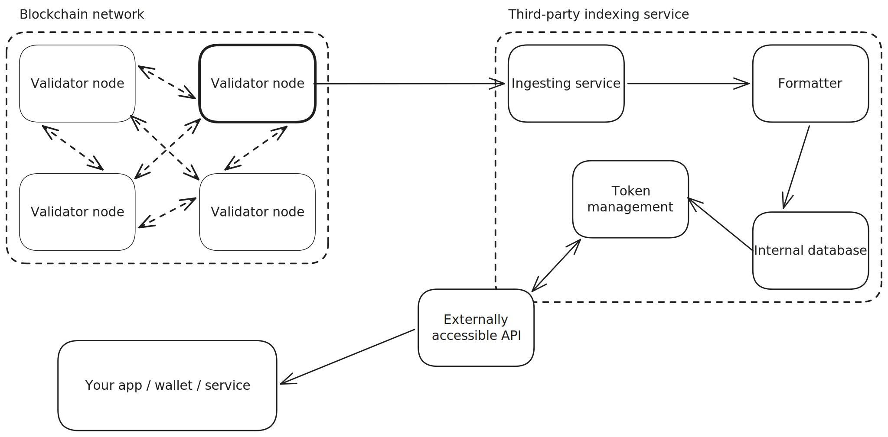
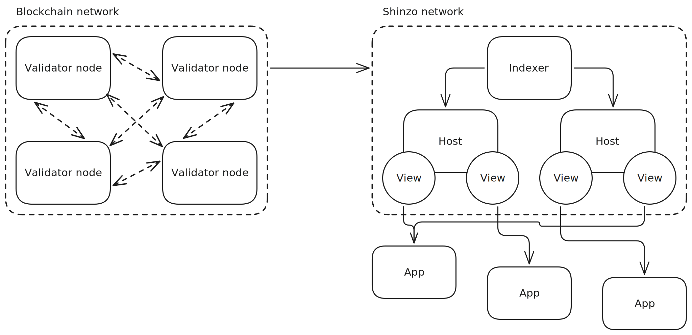

# What is Shinzo?

Shinzo is a decentralized indexing network for blockchains. It takes raw on-chain data and turns it into structured datasets that any application can query, without having to go through a centralized indexing service to get them.

If you've built any kind web3 app before, you know the usual pattern: you pick a hosted indexer, pay per API call, cache the results locally, and hope the provider doesn't go down or quietly change what's available. Shinzo replaces that setup with a network of independent operators that index the chain at the source and share the results peer to peer.

## The problem Shinzo solves

Blockchains are good at writing data and bad at reading it. If you want to show a user all their previous transactions, or count token transfers for a given contract, you can't just ask the chain. The raw data isn't organized for questions like that. So the industry bolted centralized indexing services onto the side of every chain, and those services now sit in the trust path between your app and the data.

This setup is expensive and fragile. The indexer's DNS might fail, or the cloud service hosting it might go down. And there's no way to verify that the data you're receiving is accurate until _after_ you've received (and paid) for it.

The goal of Shinzo is to make reading blockchain data as decentralized and verifiable as writing to it.

## How it works

Three kinds of participants run the network.

**Indexers** sit next to blockchain nodes and turn new blocks into structured documents as they arrive. They cryptographically sign everything they produce, so anyone downstream can check that the data came from a real indexer (and ideally several of them).

**Hosts** receive that primitive data over a peer-to-peer network and apply user-defined transforms called _Views_. They also keep attestation records, which count how many different indexers signed off on each piece of data. Applications can use those counts to set their own trust thresholds.

**Developers** define the Views. A View is basically a way to say _"here's the raw data I care about, here's how I want it filtered and decoded, and here's the schema I want it exposed as."_ Once a View is deployed, Hosts pick it up, run it, and push the results to whoever subscribes.

Underneath all of this is [DefraDB](https://github.com/sourcenetwork/defradb), a peer-to-peer document database that handles replication, access control, and GraphQL queries. Applications embed DefraDB locally and query it the way they'd query any other database, which means no per-read round trip to an external API.

## How to get involved

### Run an Indexer

If you already operate an Ethereum node, adding a Shinzo Indexer is cheap. It's a sidecar, not a separate heavyweight service. It attaches to your existing execution client (currently only Geth, but support for other clients and chains is planned), reads blocks as they come in, signs them, and gossips them out over P2P. Recommended extra resources are around 4 CPU cores, 8 GB of RAM, and 100 GB of storage with pruning on, on top of whatever the node itself needs.

:::tip
You do _not_ need to run a Validator node to run an Indexer. You can connect an Indexer to a third-party Validator node. The Validator node and the Shinzo Indexer do _not_ need to be on the same network.
:::

### Run a Host

Hosts sit between Indexers and applications. They receive signed primitive data over P2P, apply your View's Lens transforms, build attestation records, and serve results to subscribers. Running one is a good way to support the network if you don't want to operate a blockchain node.

You'll need a machine that stays online reliably. The rough recommended spec is 8 CPU cores, 16 GB of RAM, and 500 GB of SSD storage. A Host doesn't need to be close to a blockchain node, just a stable connection and enough disk for the Views it's serving.

Hosts are configured through a YAML file that lists which Views to subscribe to, the minimum number of Indexers that must have signed a document before it's accepted, and where to listen for subscriber connections. New Views can be picked up and served without restarting.

### Build a View

If you're a developer working on a dapp, wallet, or any kind of web3 app, Views are where you'll spend your time. A View is a versioned bundle that contains:

- A query describing the primitive data you want.
- A schema (GraphQL SDL) describing the shape you want to expose.
- One or more Lens transforms (WASM modules) that do the filtering and decoding.

You build Views with `viewkit`, Shinzo's CLI, and deploy them to the network. Any Host can then pick up the View, run it, and serve the results. Your application subscribes through the [app-sdk](https://github.com/shinzonetwork/app-sdk) and queries the resulting data locally.

## Where the project is today

Shinzo is in active development on devnet. These core pieces work end to end:

- The Indexer ingests Ethereum Mainnet from a Geth node, signs documents, and replicates them over DefraDB's libp2p layer.
- The Host client receives that data, builds attestation records, applies Lens transforms, and serves Views to subscribers.
- Viewkit is usable for defining, packaging, and deploying Views to devnet today.
- ShinzoHub (built on the Cosmos SDK) handles view registration and access control, and talks to Sourcehub over IBC to gate subscriptions behind payment.
- The app-sdk lets Go applications embed DefraDB and run attestation-filtered queries against it.
