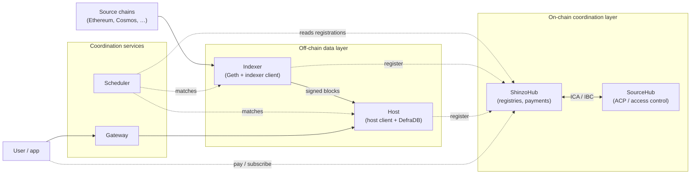
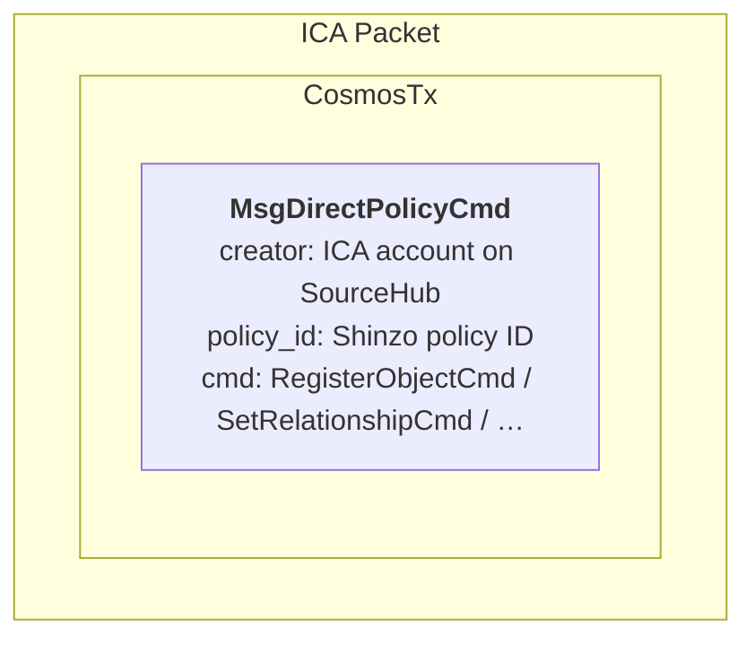
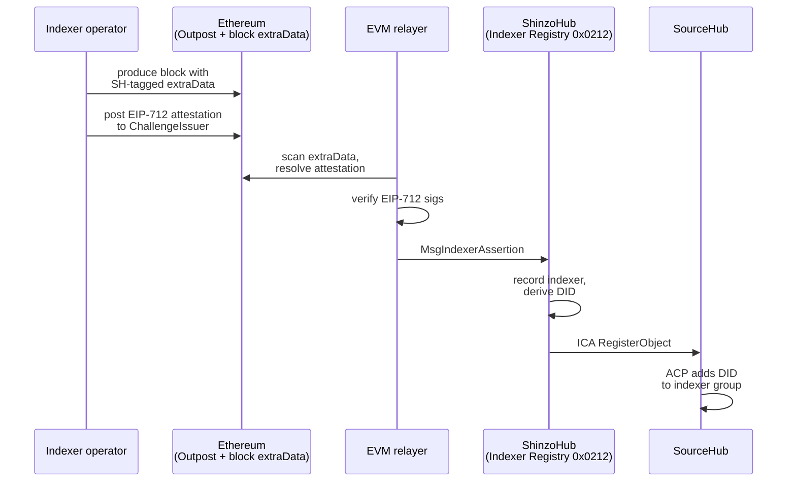
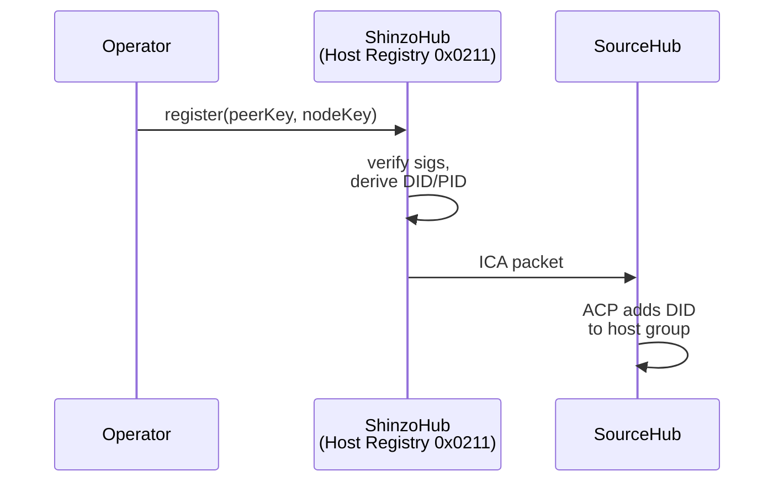
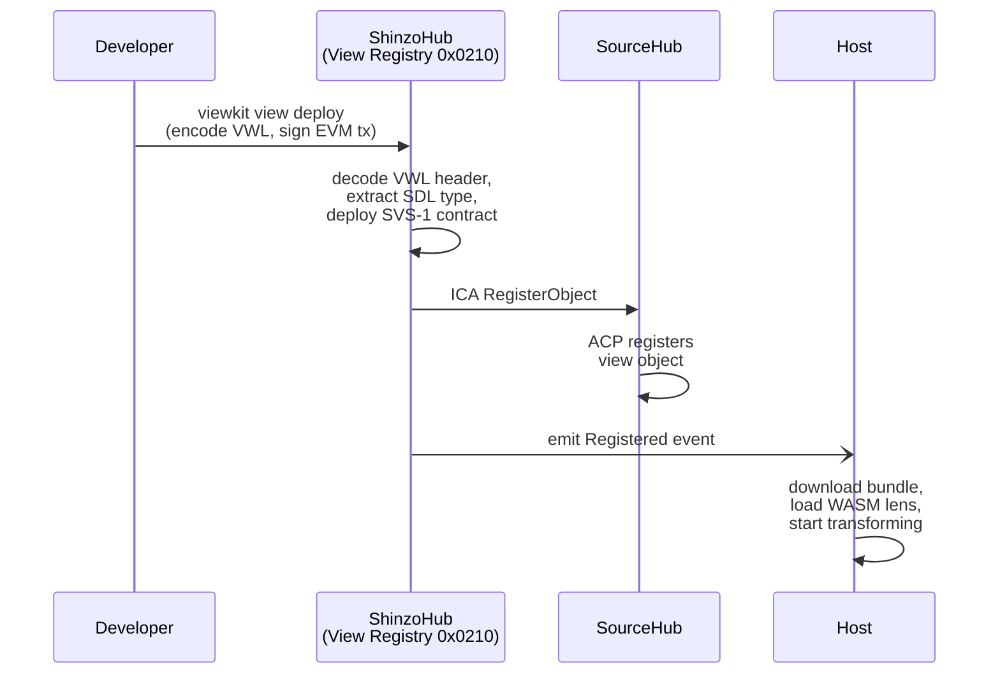

Shinzo has two layers: an on-chain coordination layer and an off-chain data layer. The on-chain layer handles registration, payments, and access control. The off-chain layer handles the actual blockchain data, from fetching it through signing and transforming it to serving it to users.

Neither layer works without the other. The on-chain layer controls who can participate. The off-chain layer does the grunt-work.

## System diagram



The scheduler and gateway are coordination services. They match indexers to hosts and route user queries to the right host. They never touch the actual data.

## Component inventory

| Component | Layer | Language | Repo | Touches data? |
| --- | --- | --- | --- | --- |
| Geth (source chain node) | Off-chain | Go | [go-ethereum](https://github.com/ethereum/go-ethereum) | Yes |
| Indexer client | Off-chain | Go | [shinzo-indexer-client](https://github.com/shinzonetwork/shinzo-indexer-client/) | Yes |
| Host client | Off-chain | Go | [shinzo-host-client](https://github.com/shinzonetwork/shinzo-host-client/) | Yes |
| Scheduler | Off-chain | Go | [shinzo-scheduler-service](https://github.com/shinzonetwork/shinzo-scheduler-service) | No |
| Network gateway | Off-chain | Go | [shinzo-network-gateway](https://github.com/shinzonetwork/shinzo-network-gateway) | No |
| ShinzoHub | On-chain | Go (Cosmos SDK) | [shinzohub](https://github.com/shinzonetwork/shinzohub) | No |
| SourceHub | On-chain | Go (Cosmos SDK) | [sourcehub](https://github.com/sourcenetwork/sourcehub) | No |
| EVM relayer | Off-chain | Go | [shinzo-evm-relayer](https://github.com/shinzonetwork/shinzo-evm-relayer) | No |
| Outpost contract | On-chain | Solidity | [shinzo-outpost](https://github.com/shinzonetwork/shinzo-outpost-contract) | No |
| View creator (viewkit) | Off-chain | Go | [shinzo-view-creator](https://github.com/shinzonetwork/shinzo-view-creator) | No |
| DefraDB | Off-chain | Go | [defradb](https://github.com/sourcenetwork/defradb) | Yes |
| Lens (LensVM) | Off-chain | Go/WASM | [lens](https://github.com/sourcenetwork/lens) | Yes |

## The two chains

### ShinzoHub

ShinzoHub is a Cosmos SDK chain with an integrated EVM, running CometBFT consensus. Its native token is SHNZ.

ShinzoHub maintains three EVM precompile registries:

| Address | Registry | Purpose |
| --- | --- | --- |
| `0x0210` | View Registry | Registers views, deploys SVS-1 contracts. |
| `0x0211` | Host Registry | Tracks registered hosts. |
| `0x0212` | Indexer Registry | Tracks registered indexers. |

These precompiles are implemented in Go, not Solidity bytecode. They have direct access to Cosmos SDK keepers, which is how EVM transactions trigger cross-chain ICA calls to SourceHub.

ShinzoHub also runs five custom Cosmos modules: `x/admin`, `x/sourcehub` (ICA controller), `x/host`, `x/indexer`, and `x/view`. These run alongside the standard Cosmos modules (auth, bank, staking, etc.).

#### Chain IDs

| Environment | Chain ID |
| --- | --- |
| Devnet | 91273002 |
| Testnet | 91273001 |
| Mainnet | 91273000 |

### SourceHub

SourceHub is a separate Cosmos SDK chain built by [Source Network](https://source.network/). It runs the Access Control Policy (ACP) module, which implements Google's Zanzibar authorization model.

The ACP module stores authorization tuples:

```plaintext
object#relation@user
```

For example:

```plaintext
group:host#guest@did:key:z6MkHost7
view:0xABC#subscriber@did:key:z6MkUser1
```

Permission checks evaluate whether a chain of tuples grants a specific action. Permissions are boolean expressions over relations: `admin + creator + subscriber - banned` means anyone with the admin, creator, or subscriber relation, unless they are also banned.

SourceHub manages two independent policy domains:

1. Protocol participation: which DIDs are registered as hosts or indexers (`group:host`, `group:indexer`).
1. View access: which DIDs can read which views (`view:0xABC#subscriber`).

Users never interact with SourceHub directly. ShinzoHub sends commands to it via ICA.

## Cross-chain communication with IBC and ICA

ShinzoHub and SourceHub communicate over IBC (Inter-Blockchain Communication). IBC has four layers:

- Application layer: ICA (Interchain Accounts), IBC Transfer.
- Channel layer: Ordered or unordered packet deliver. ICA uses `ORDERED` channels.
- Connection layer: Links two chains via their light-clients.
- Client layer: Each chain runs a light-client of the other, and verifies state proofs against block headers.

:::info
The bottom two layers (clients and connections) are set up once and persist. The channel layer is somewhat fragile. ICA channels use `ORDERED` delivery, meaning packets must arrive in sequence. If any packet times out, the channel closes permanently and a new one must be opened.
:::

ICA lets ShinzoHub control an account on SourceHub. When a precompile registration happens on ShinzoHub, the keeper constructs an ICA packet wrapping a `MsgDirectPolicyCmd` and sends it to SourceHub. The packet structure:



The Hermes relayer (Rust binary by [Informal Systems](https://hermes.informal.systems/) is the off-chain process that physically moves packets between chains. It reads outbound packets from ShinzoHub's state, fetches Merkle proofs, and submits them to SourceHub. It then reads acknowledgements from SourceHub and returns them to ShinzoHub. Hermes is stateless and trustless. It cannot fabricate packets because SourceHub verifies each packet against a state proof.

The ICA relay is asynchronous. When a precompile call triggers an ICA packet, the EVM transaction completes and returns a receipt before SourceHub has processed anything. If the ICA packet fails or times out, the EVM transaction still succeeded. The two outcomes are independent.

The `x/sourcehub` keeper uses a hardcoded 5-minute timeout on all `SendTx` calls. If SourceHub does not acknowledge within that window, the packet times out and the channel closes.

## The bridge to source chains

Two components connect external blockchains (Ethereum, Cosmos chains, etc.) to ShinzoHub.

### Outpost contracts

Outpost contracts are deployed on each source chain. They handle two things:

- Validator assertions: A challenge-response protocol where a validator proves their identity using chain-native mechanisms. On Ethereum, this uses EIP-712 typed signatures and embeds a 15-byte pointer in the block's `extraData` field with an `SH` prefix. Only block producers can write `extraData`, so the tag is proof of validator status.
- Payments: Users call `payment()` on the outpost. The contract stores a receipt and emits a `PaymentCreated` event.

The outpost design is chain agnostic. Each chain gets its own implementation using whatever verification mechanism is native to that chain. The only requirement is that the output is a signed assertion that a relayer can deliver to ShinzoHub.

### Relayers (EVM relayer)

The EVM relayer is a Go process with two pipelines:

1. The assertion pipeline scans each Ethereum block's `extraData` for the `SH` tag, extracts the pointer, resolves it to an attestation on the `ChallengeIssuer` contract, verifies the EIP-712 signatures, and broadcasts `MsgIndexerAssertion` to ShinzoHub.
1. The payment pipeline subscribes to `PaymentCreated` log events from the outpost, extracts user `DID` and payment amount, and broadcasts `MsgRequestStreamAccess` to ShinzoHub.

The relayer maintains a persistent block cursor so it can resume where it left off after a restart. It has its own wallet on ShinzoHub and needs SHNZ for gas.

:::note
The EVM relayer and the Hermes IBC relayer are completely different systems. The EVM relayer bridges Ethereum to ShinzoHub. The Hermes relayer bridges ShinzoHub to SourceHub over IBC. They share the word _relayer_ and nothing else.
:::

## Off-chain data flow

### DefraDB

DefraDB is the peer-to-peer document database embedded in every indexer and host. Three separate DefraDB instances exist in the system (one per indexer, one per host for primitives, one per host for view data).

DefraDB uses MerkleCRDTs, a combination of Merkle DAGs and CRDTs. Document updates are stored as a Merkle DAG where each node is a CRDT operation. CRDTs give you conflict resolution without coordination. The Merkle DAG gives you verifiable history. And because nodes can diff DAGs, sync only transfers the missing pieces.

Documents are content-addressed using CIDs (Content Identifiers). The CID is a hash of the document content, so verification is just re-hashing and comparing. DefraDB schemas are defined in GraphQL SDL, and queries use standard GraphQL syntax.

### P2P topology

Data replication uses libp2p, managed internally by DefraDB. The flow for a new document:

1. Indexer writes document to its local DefraDB.
1. DefraDB computes a content digest.
1. DefraDB gossips the digest to connected peers.
1. Peers that want the document request the full content.
1. DefraDB sends the full document.

Indexers are write-only. They publish documents and reject all incoming replication (enforced by a replication filter in the indexer client). Hosts accept incoming documents from indexers and replicate attestation records between each other.

Peers discover each other through bootstrap peers configured in DefraDB and through `EntityRegistered` events from ShinzoHub (when new indexers or hosts join the network).

### Signing and attestation

Each indexer signs every block batch it produces. After writing all documents for a block (Block, Transaction, Log, AccessListEntry), the indexer computes a Merkle root over all document CIDs, signs it with its identity key, and writes a `BlockSignature` document. Individual documents also carry per-document signatures in their `_version` array.

Hosts verify incoming `BlockSignature` documents by recomputing the Merkle root and checking the signature against the indexer's known identity. They then create `AttestationRecord` documents that track how many independent indexers produced the same data. The `vote_count` field uses a P-counter CRDT, which merges deterministically across hosts.

Snapshots bundle multiple blocks into signed files for faster initial sync. The indexer periodically creates `SnapshotSignature` documents whose Merkle root is computed over the per-block `BlockSignature` roots within the range. So you get a two-level Merkle tree: document CIDs roll up into per-block roots, which roll up into per-snapshot roots.

## Registration flows

### Indexer registration

Spans two chains and a relayer:



### Host registration



### View registration



## Transaction flow through a precompile

The full path of an EVM transaction that hits a registry precompile and triggers a cross-chain ICA call:

1. User sends an EVM tx to a precompile (e.g. `0x0210`).
1. A validator includes the tx in a ShinzoHub block.
1. The EVM calls `precompile.Run()`.
1. The precompile Go code runs five sequential operations:
   1. Decode ABI arguments.
   1. Run business logic (validate, store).
   1. Call the Cosmos keeper (e.g. `RegisterObject`).
   1. The keeper builds an ICA packet and commits it to IBC state.
   1. Emit an EVM log and a Cosmos event.
1. Hermes picks up the ICA packet (async).
1. Hermes submits the packet plus state proof to SourceHub.
1. SourceHub verifies the proof and executes the ACP command.
1. Hermes relays the acknowledgement back to ShinzoHub.

The precompile emits both a Solidity EVM log and a Cosmos SDK event. The event names differ between layers:

| Precompile | EVM log | Cosmos event |
| --- | --- | --- |
| View Registry (0x0210) | `ViewCreated(address,address,string)` | `"ViewRegistered"` |
| Host Registry (0x0211) | `Registered(address,string)` | `"HostRegistered"` |
| Indexer Registry (0x0212) | `Registered(address,string)` | `"Registered"` |
