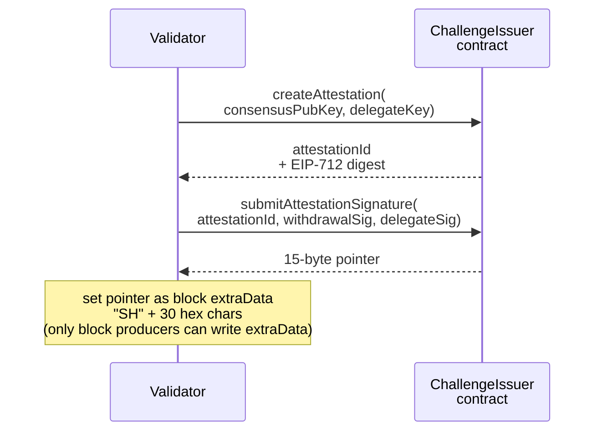

An outpost is a smart contract deployed on an external chain (not ShinzoHub) that does two things: lets validators prove their identity so they can register as indexers, and lets users pay for view access without interacting with ShinzoHub directly.

Outposts are how external chains connect into the Shinzo network. They handle source chain local logic. [Relayers](relayer.md) bridge the results to [ShinzoHub](shinzohub.md).

## Why outposts exist

ShinzoHub cannot directly verify that a validator on another chain is who they claim to be. Every chain has its own consensus mechanism and key types. The outpost runs on the same chain as the validator, where that chain's native tools can verify identity.

Outposts also handle payments. Users on external chains should be able to pay in their chain's native currency without bridging tokens to ShinzoHub first.

## Validator assertions

An assertion is a cryptographic proof that a validator on an external chain is who they claim to be. This is a prerequisite for becoming an indexer. A validator cannot register as an indexer directly on ShinzoHub; they must go through the assertion process on their source chain first.

The flow:

1. Validator calls the outpost contract, providing their consensus public key and a delegate key.
1. Outpost verifies the validator using the chain's native mechanism.
1. Both the validator (withdrawal address) and the delegate sign a digest.
1. A [relayer](relayer.md) picks up the signed assertion and broadcasts `MsgIndexerAssertion` to ShinzoHub.
1. ShinzoHub verifies the assertion. The validator can now register in the Indexer Registry (`0x0212`).

### The digest

The outpost generates a hash that both parties must sign. The digest includes the assertion ID, withdrawal address, delegate key, consensus key hash, creation time, and signature deadline.

How the digest is computed depends on the implementation. Different chains have different hashing and signing conventions. The requirement is that the digest is deterministic and includes enough context to prevent replay attacks across chains.

### EVM implementation

On Ethereum, the outpost contract (`ShinzoChallengeIssuerV1`) uses EIP-712 typed data signatures and a two-step process:

The "SH" prefix in `extraData` is the verification mechanism. Only actual block producers can set the `extraData` field of a block they propose. If a block's `extraData` starts with "SH", the block's proposer has a registered attestation on the ChallengeIssuer contract.

### Chain-specific verification

The verification step is what makes each outpost implementation different. The concept is always the same (prove you are a validator), but the proof mechanism depends on the chain.

Some chains let you query the staking module to check if an address is bonded. Some use block production as proof. Others might use multisig schemes or oracle attestations. The outpost interface does not prescribe a mechanism. Each implementation uses whatever works on its chain.

## Payments

Users on external chains can pay for Shinzo resources without interacting with ShinzoHub.

1. User calls `payment()` with a resource type, their DID, a stream ID, and an expiration duration.
1. The contract stores a `PaymentReceipt` and emits a `PaymentCreated` event.
1. A [relayer](relayer.md) picks up the event and delivers it to ShinzoHub as `MsgRequestStreamAccess`.

## Implementations

| Implementation | Chain type | Status |
| --- | --- | --- |
| shinzo-outpost | EVM (Ethereum, L2s) | Complete |
| Cosmos outpost | Cosmos SDK chains | Not yet implemented |
| CosmosEVM outpost | Hybrid Cosmos+EVM chains | Not yet implemented |

Each chain type gets its own outpost implementation. The verification mechanism can be completely different as long as the output (a signed assertion that a relayer can deliver) follows the same format. A Cosmos outpost would be a CosmWasm contract querying the staking module. For CosmosEVM chains, a Solidity contract could call the staking precompile at `0x0800`.
